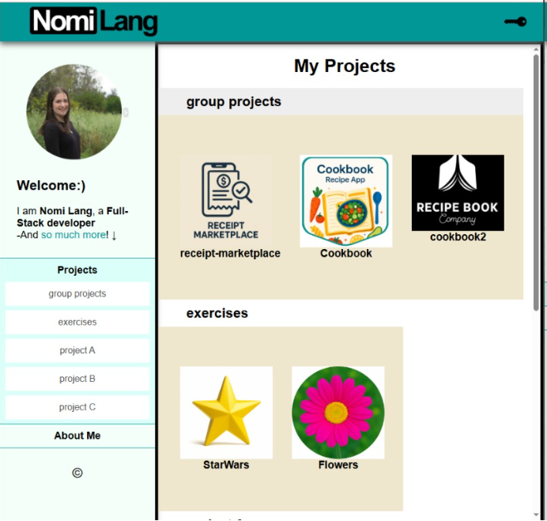
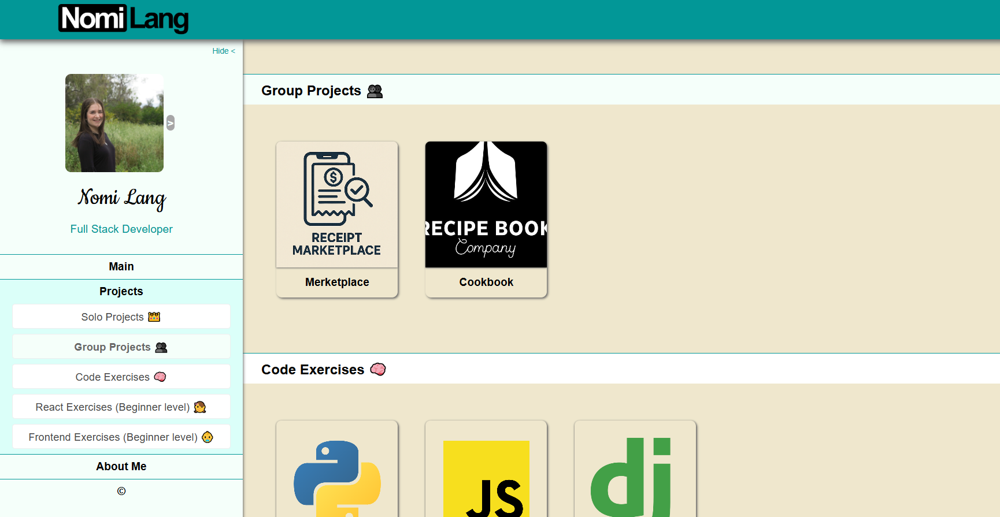
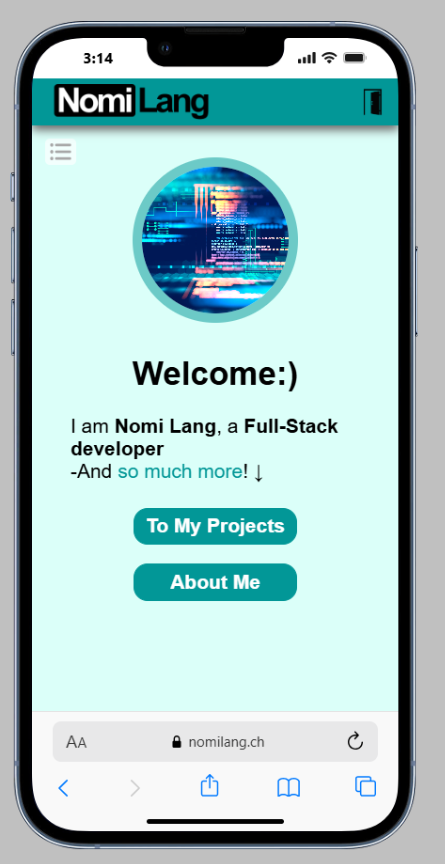
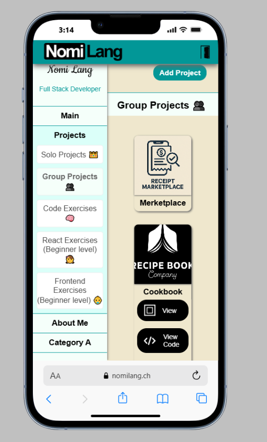
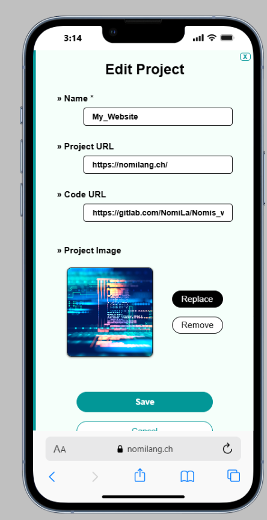
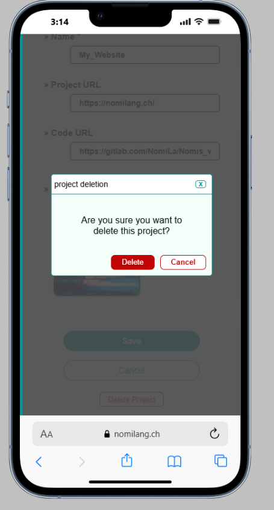
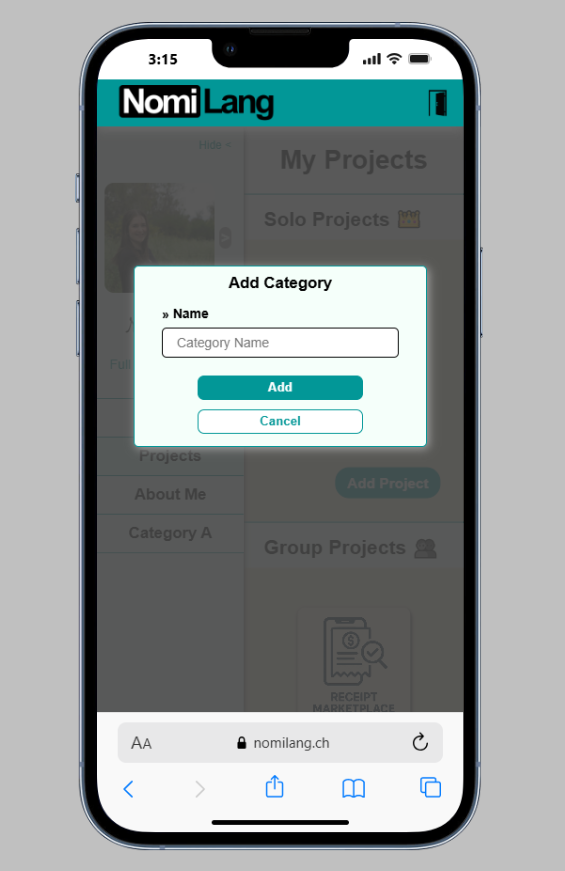
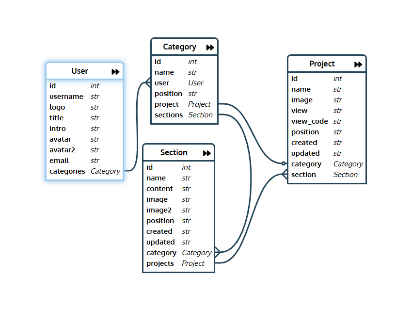
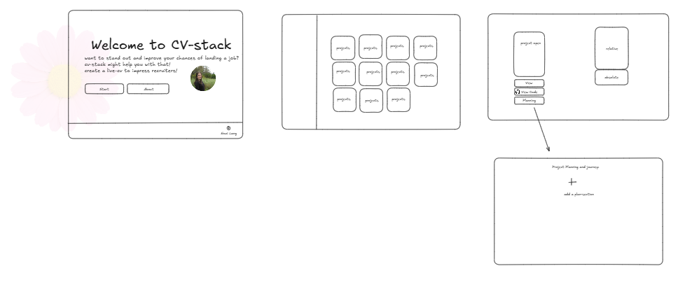

## Project Name
Space-Folio

## Summarize
A live portfolio space for developers
Space-Folio is a simple and customizable portfolio platform for developers.
Each user can create a personal live portfolio space, display projects, and share achievements in a clear and modern UI.

## Project status
In Development

## Description
This is a portfolio website, specifically for developers.
In this website, you can have your own live portfolio space to show to whoever matters ;)
The app is simple and clear to use, for both users and visitors.

Features:
- Display your **projects** neatly in a pleasant clear appearance.
- '**About me**' category, with sections telling about yourself
- In addition, you can add categories and sections of your own. 
- Up to 2 pictures per section for emphasis or illustration.
- All in a clean, easy to use and to watch UI
- User safety and security implemented. (-The only one in charge of your content is you)
- Completely responsive design

currently the website is under construction. you can see an example version at https://nomilang.ch/ -temporarily!

This project was built from scratch with custom code

## Visuals
how it looked at the beginning:

vs how it looks now:

some proper planing:

scratch that, minimalize:

brainstorming:

## Installation
The only technology required for **using** the app-folio is a browser and working internet connection

For installment or development:
technologies required:
- node
- docker desktop
- code editor (VsCode, PyCharm, etc)

Installation process:
1. Clone from git
2. Working directory 'backend/' run: docker build -t my_website . 
3. Working directory 'frontend/' run: npm i
4. Developing **backend** on localhost:
   - docker compose up
   
   Go to 'http://localhost:8000/backend/admin/'.

   Then to stop:
   - docker compose down --remove-orphans
5. Developing **frontend** on local:
    - npm run dev
   
    Visit 'http://localhost:5173/'

## Usage
- Showing your achievements along your career in a light, eye-catching way. 
- Have all your projects centralized.

## Roadmap
In the near future:
- User authentication (registration & login)
- Multi-language support (Hebrew/English)
- Color theme customization

## Technologies
Frontend:
- React
- React-Router
- Saas

Backend:
- Django
- Django REST framework

Devops:
- Nginx
- Docker
- Digital Ocean Droplet
- GitLab CI/CD

## Support /contribution
This portfolio website is a solo, newly created project. 
I am very open to suggestions and improvements: 

- Any additional features you would like to have that will likely encourage you more to use the platform,
- Any bugs needed to be fixed 
- Any suggestions for improved design

Issues and suggestions are welcome through GitHub issues or via email: nomilang10@gmail.com.

## Authors and license
© 2025 @NomiLa All rights reserved.

